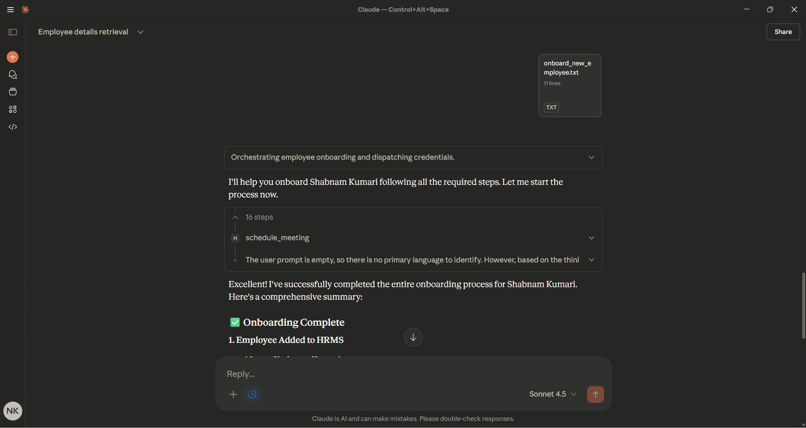
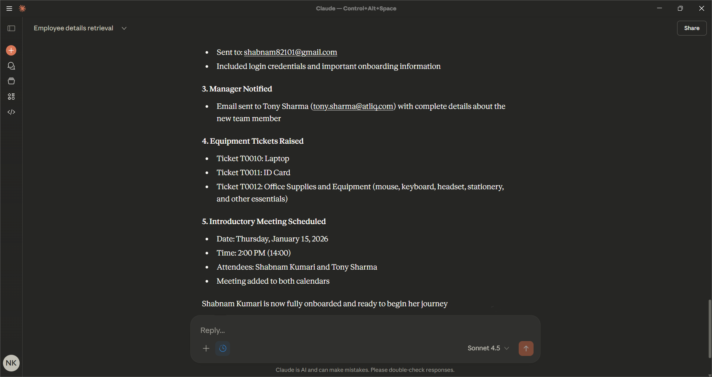
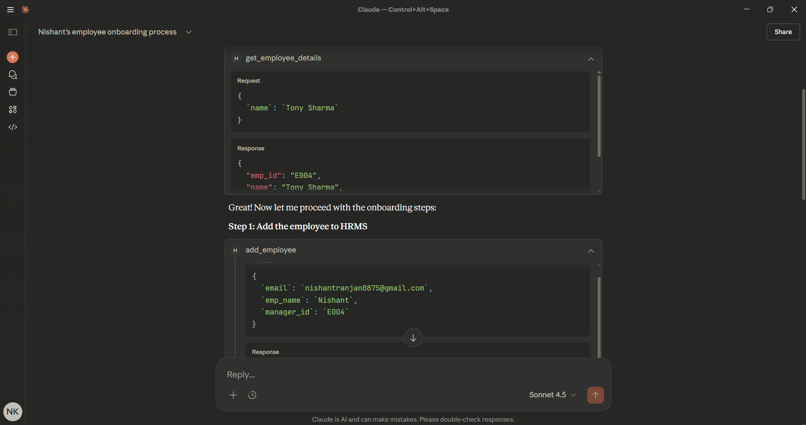
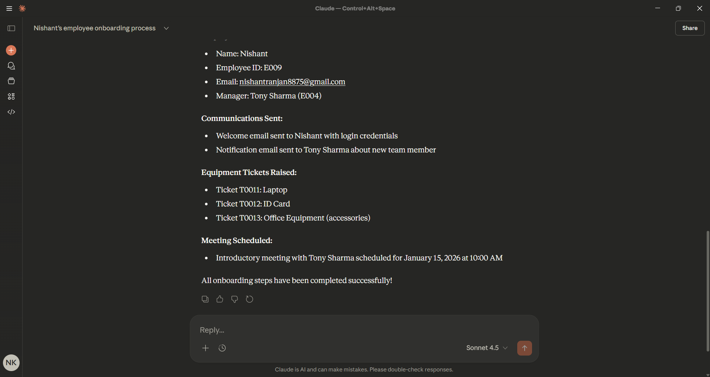

# 🤖 HR Assistant Agent

> An intelligent, MCP-powered HR management system that automates employee onboarding, leave management, meeting scheduling, and IT ticketing through conversational AI.

## 📖 Overview

HR Assistant Agent is an AI-powered human resources management system built on the Model Context Protocol (MCP). It streamlines HR operations by providing a conversational interface for common HR tasks, reducing administrative overhead and enabling HR teams to focus on strategic initiatives rather than repetitive tasks.

The system integrates employee management, leave tracking, meeting coordination, and IT equipment provisioning into a unified platform accessible through natural language interactions with Claude AI.

## 📊 Visual Insights

Below are real-world examples of the HR Assistant Agent in action, demonstrating its automated onboarding workflow and MCP tool interactions.

| 📸 Screenshot | 🔍 Description |
|--------------|----------------|
|  | Complete Onboarding Workflow - Shows Claude orchestrating the full employee onboarding for "Shabnam Kumari" with 16 automated steps including HRMS addition, welcome email, manager notification, equipment tickets, and meeting scheduling.|
|  | Onboarding Completion Summary - Detailed breakdown showing successful completion of all tasks: welcome email sent to shabnam82101@gmail.com, manager Tony Sharma notified, three equipment tickets raised (Laptop, ID Card, Office Supplies), and introductory meeting scheduled for January 15, 2026.|
|  | Behind-the-Scenes MCP Tool Calls - Demonstrates the technical execution showing get_employee_details request/response for Tony Sharma (E004) and add_employee tool call with JSON parameters for onboarding "Nishant" under manager E004.|
|  | Final Onboarding Confirmation - Shows successful onboarding of "Nishant" (E009) with all steps completed: employee added, welcome email sent, manager notification delivered, three equipment tickets created (T0011-T0013), and introductory meeting scheduled for January 15, 2026 at 10:00 AM.|

### Key Features

- **🧑‍💼 Employee Management**: Add employees, retrieve details, search by name, and manage organizational hierarchy
- **📅 Leave Management**: Track leave balances, process applications, and maintain leave history
- **🗓️ Meeting Scheduler**: Schedule, view, and cancel meetings with conflict detection
- **🎫 IT Ticketing**: Create and track equipment requests (laptops, monitors, accessories)
- **📧 Email Automation**: Automated email notifications for onboarding, approvals, and updates
- **🚀 Smart Onboarding**: Complete employee onboarding workflow with a single prompt

## 🎯 Why It Matters

### Problems It Solves

1. **Manual HR Processes**: Eliminates repetitive manual data entry and form filling
2. **Fragmented Systems**: Unifies multiple HR functions into one conversational interface
3. **Onboarding Complexity**: Reduces multi-day onboarding to minutes with automated workflows
4. **Communication Overhead**: Automates routine notifications and reminders
5. **Data Accessibility**: Provides instant access to employee information without navigating multiple systems

### Real-World Impact

- **Time Savings**: Reduces onboarding time from hours to minutes
- **Error Reduction**: Automated workflows minimize human error in data entry
- **Scalability**: Easily handles growing employee bases without proportional HR staff increases
- **Employee Experience**: New hires receive timely communication and equipment provisioning

## 🏗️ Architecture

### System Design

```
┌─────────────────────────────────────────────────────────────┐
│                        Claude AI                            │
│                 (Conversational Interface)                  │
└────────────────────────┬────────────────────────────────────┘
                         │
                         │ MCP Protocol
                         │
┌────────────────────────▼────────────────────────────────────┐
│                    FastMCP Server                           │
│                    (server.py)                              │
│                                                             │
│  ┌──────────────────────────────────────────────────────┐   │
│  │              MCP Tools Layer                         │   │
│  │  • add_employee      • schedule_meeting              │   │
│  │  • get_employee      • cancel_meeting                │   │
│  │  • apply_leave       • create_ticket                 │   │
│  │  • send_email        • update_ticket                 │   │
│  └──────────────────────────────────────────────────────┘   │
└────────────────────────┬────────────────────────────────────┘
                         │
            ┌────────────┼────────────┐
            │            │            │
┌───────────▼──┐  ┌──────▼─────┐  ┌──▼──────────┐
│  Employee    │  │   Leave    │  │  Meeting    │
│  Manager     │  │  Manager   │  │  Manager    │
└──────────────┘  └────────────┘  └─────────────┘
            │            │            │
            └────────────┼────────────┘
                         │
                ┌────────▼─────────┐
                │  Ticket Manager  │
                └──────────────────┘
                         │
                ┌────────▼─────────┐
                │  Email Sender    │
                │   (SMTP/Gmail)   │
                └──────────────────┘
```

### Component Breakdown

#### 1. MCP Server Layer (`server.py`)
- Exposes HR operations as MCP tools
- Handles request routing and validation
- Manages prompt templates for complex workflows
- Coordinates between different managers

#### 2. Business Logic Layer
- **EmployeeManager**: Handles employee CRUD operations and organizational structure
- **LeaveManager**: Processes leave requests and maintains balance/history
- **MeetingManager**: Schedules meetings with conflict detection
- **TicketManager**: Tracks IT equipment requests through their lifecycle

#### 3. Communication Layer (`emails.py`)
- SMTP integration for automated email notifications
- Support for HTML emails and attachments
- TLS/SSL secure connections

#### 4. Data Layer (`utils.py`)
- Seeded test data for development
- Mock employee database with 8 employees
- Sample leave records, meetings, and tickets

## 📁 Project Structure

```
HR-Assistant-Agent/
│
├── HRMS/                          # Core HR management modules
│   ├── __init__.py               # Package initialization
│   ├── employee_manager.py       # Employee operations
│   ├── leave_manager.py          # Leave tracking
│   ├── meeting_manager.py        # Meeting scheduling
│   ├── ticket_manager.py         # IT ticketing system
│   └── schemas.py                # Pydantic data models
│
├── server.py                      # FastMCP server & tool definitions
├── emails.py                      # Email automation module
├── utils.py                       # Data seeding utilities
│
├── .env                          # Environment variables (not in repo)
├── .gitignore                    # Git ignore rules
├── pyproject.toml                # Project dependencies
├── python-version.txt            # Python version specification
├── README.md                     # This file
└── uv.lock                       # Dependency lock file
```

## 🛠️ Tech Stack

### Core Technologies

| Technology | Purpose | Version |
|-----------|---------|---------|
| **Python** | Primary language | 3.8+ |
| **FastMCP** | MCP server framework | Latest |
| **Pydantic** | Data validation | 2.0+ |
| **Claude AI** | Conversational interface | Sonnet 4.5 |

### Key Libraries

- **smtplib**: SMTP email protocol
- **ssl**: Secure email connections
- **dotenv**: Environment variable management
- **datetime**: Date/time handling
- **typing**: Type hints and validation
- **difflib**: Fuzzy name matching

### Development Tools

- **uv**: Fast Python package installer
- **VS Code**: Recommended IDE
- **Git**: Version control

## 🚀 Setup & Installation

### Prerequisites

- Python 3.8 or higher
- Gmail account (for email functionality)
- [uv package manager](https://github.com/astral-sh/uv) (optional but recommended)
- Claude Desktop or API access

### Step 1: Clone the Repository

```bash
git clone https://github.com/yourusername/hr-assistant-agent.git
cd hr-assistant-agent
```

### Step 2: Install Dependencies

**Using uv (Recommended):**
```bash
uv pip install -r requirements.txt
```

**Using pip:**
```bash
pip install fastmcp pydantic python-dotenv
```

### Step 3: Configure Environment Variables

Create a `.env` file in the project root:

```env
SENDER_EMAIL=your-email@gmail.com
SENDER_EMAIL_PWD=your-app-password
```

**📌 Important**: For Gmail, you need to generate an [App Password](https://support.google.com/accounts/answer/185833):
1. Enable 2-Factor Authentication on your Google account
2. Go to Google Account Settings → Security → 2-Step Verification → App Passwords
3. Generate a new app password for "Mail"
4. Use this password in `SENDER_EMAIL_PWD`

### Step 4: Configure Claude Desktop

Add the server to your Claude Desktop configuration:

**Location**: 
- macOS: `~/Library/Application Support/Claude/claude_desktop_config.json`
- Windows: `%APPDATA%\Claude\claude_desktop_config.json`

**Configuration**:
```json
{
  "mcpServers": {
    "hr-assistant": {
      "command": "python",
      "args": ["/absolute/path/to/server.py"],
      "env": {
        "SENDER_EMAIL": "your-email@gmail.com",
        "SENDER_EMAIL_PWD": "your-app-password"
      }
    }
  }
}
```

### Step 5: Run the Server

**Standalone Mode (for testing):**
```bash
python server.py
```

**With Claude Desktop:**
1. Restart Claude Desktop
2. Look for the 🔌 icon indicating MCP connection
3. Start interacting with your HR Assistant!

## 💡 Usage Examples

### Example 1: Onboarding a New Employee

```
You: Onboard a new employee named Alex Thompson with email alex.thompson@bluparrot.in 
     reporting to Sarah Johnson

Claude: I'll help you onboard Alex Thompson. Let me:
        1. Add them to the system
        2. Send welcome email
        3. Notify their manager
        4. Create equipment tickets
        5. Schedule introductory meeting
        
        ✅ Alex Thompson (E009) added successfully
        ✅ Welcome email sent
        ✅ Manager Sarah Johnson notified
        ✅ Tickets created: Laptop, ID Card
        ✅ Meeting scheduled for tomorrow at 10 AM
```

### Example 2: Checking Leave Balance

```
You: What's Tony Sharma's leave balance?

Claude: Tony Sharma (E004) has 12 leave days remaining.
```

### Example 3: Scheduling a Meeting

```
You: Schedule a team sync meeting for David Wilson on January 20, 2026 at 2 PM

Claude: Meeting scheduled for E003 on 2026-01-20T14:00:00 about 'Team Sync'.
```

### Example 4: Creating an IT Ticket

```
You: Create a ticket for Lisa Wong requesting a new monitor for dual screen setup

Claude: Ticket T0012 created for E008 requesting 'Monitor' for dual screen setup.
```

## 📊 Seeded Test Data

The system comes pre-populated with test data for immediate experimentation:

### Organizational Structure

```
Sarah Johnson (E001) - CEO
├── David Wilson (E003) - Engineering Manager
│   ├── Tony Sharma (E004) - Software Engineer
│   └── James Rodriguez (E005) - Software Engineer
│
Michael Chen (E002) - CPO
└── Emily Kim (E006) - Product Manager
    ├── Carlos Mendez (E007) - Product Designer
    └── Lisa Wong (E008) - Product Analyst
```

### Sample Data Includes
- **8 Employees** across leadership, engineering, and product teams
- **Random leave balances** (5-20 days per employee)
- **Historical leave records** (1-90 days ago)
- **Scheduled meetings** (next 10 days)
- **IT tickets** (laptops, monitors, accessories)


## 🔧 Configuration Options

### Email Settings

Modify the `EmailSender` initialization in `server.py`:

```python
emailer = EmailSender(
    smtp_server="smtp.gmail.com",  # Change for other providers
    port=587,                       # 587 for TLS, 465 for SSL
    username=os.getenv("SENDER_EMAIL"),
    password=os.getenv("SENDER_EMAIL_PWD"),
    use_tls=True                    # False for SSL
)
```

### Leave Balance Defaults

Adjust in `leave_manager.py`:

```python
self.employee_leaves: Dict[str, Dict] = defaultdict(
    lambda: {"balance": 20, "history": []}  # Change default balance
)
```

### Ticket ID Format

Modify in `ticket_manager.py`:

```python
ticket_id = f"T{self._next_id:04d}"  # Format: T0001, T0002, etc.
```

## 🔒 Security Considerations

### Best Practices Implemented

1. **Environment Variables**: Sensitive credentials stored in `.env` file
2. **TLS/SSL**: Encrypted email communications
3. **No Hardcoded Secrets**: All passwords and tokens externalized
4. **Input Validation**: Pydantic schemas validate all inputs
5. **Error Handling**: Graceful error messages without exposing internals

### Additional Recommendations

- **Never commit `.env` file** to version control
- **Use app-specific passwords** for Gmail (not your main password)
- **Implement rate limiting** for production deployments
- **Add authentication** if exposing as a web service
- **Audit logs** for sensitive HR operations
- **Encrypt stored data** in production databases

## 🐛 Troubleshooting

### Common Issues

#### 1. Email Not Sending

**Problem**: `SMTPAuthenticationError: Username and Password not accepted`

**Solution**: 
- Ensure 2FA is enabled on your Google account
- Generate an App Password (not your regular password)
- Verify `.env` file has correct credentials

#### 2. MCP Server Not Connecting

**Problem**: Claude Desktop doesn't show MCP connection

**Solution**:
- Check `claude_desktop_config.json` has correct absolute path
- Restart Claude Desktop completely
- Verify Python path in configuration
- Check server.py runs without errors standalone

#### 3. Employee Not Found

**Problem**: `ValueError: Employee ID 'E999' not found`

**Solution**:
- Use `search_employee_by_name()` for fuzzy matching
- Check employee exists in seeded data
- Verify employee ID format (E001, E002, etc.)

#### 4. Meeting Conflict Error

**Problem**: `ValueError: Conflict: E001 already has a meeting at datetime`

**Solution**:
- Check existing meetings with `get_meetings()`
- Choose a different time slot
- Cancel conflicting meeting first if needed

### Debug Mode

Enable detailed logging:

```python
import logging
logging.basicConfig(level=logging.DEBUG)
```

## 🤝 Contributing

Contributions are welcome! Here's how you can help:

### Areas for Improvement

- [ ] Database integration (PostgreSQL/MongoDB)
- [ ] REST API endpoints
- [ ] Web dashboard UI
- [ ] Slack/Teams integration
- [ ] Calendar sync (Google Calendar, Outlook)
- [ ] Performance reviews module
- [ ] Payroll integration
- [ ] Advanced reporting and analytics
- [ ] Multi-language support
- [ ] Mobile app

### How to Contribute

1. Fork the repository
2. Create a feature branch (`git checkout -b feature/amazing-feature`)
3. Commit your changes (`git commit -m 'Add amazing feature'`)
4. Push to the branch (`git push origin feature/amazing-feature`)
5. Open a Pull Request

### Code Standards

- Follow PEP 8 style guide
- Add type hints to all functions
- Write docstrings for public methods
- Include unit tests for new features
- Update README for new functionality

## 📝 License

This project is licensed under the MIT License - see the [LICENSE](LICENSE) file for details.

## 🙏 Acknowledgments

- **Anthropic** for Claude AI and MCP protocol
- **FastMCP** team for the excellent MCP framework
- **Pydantic** for robust data validation
- Open source community for inspiration

## 📞 Support

- **Issues**: [GitHub Issues](https://github.com/yourusername/hr-assistant-agent/issues)
- **Discussions**: [GitHub Discussions](https://github.com/yourusername/hr-assistant-agent/discussions)
- **Email**: nishantranjan8875@gmail.com

## 🗺️ Roadmap

### Version 2.0 (Q2 2026)
- [ ] PostgreSQL database backend
- [ ] REST API with FastAPI
- [ ] Authentication and authorization
- [ ] Audit logging

### Version 3.0 (Q3 2026)
- [ ] Web-based admin dashboard
- [ ] Real-time notifications
- [ ] Document management
- [ ] Performance review workflows

### Version 4.0 (Q4 2026)
- [ ] AI-powered HR insights
- [ ] Predictive analytics
- [ ] Mobile applications
- [ ] Multi-tenant support

## 👨‍💻 Author

**NISHU KUMAR**

- GitHub: [My Github Profile](https://github.com/NISHU8875)
- LinkedIn: [LinkedIn](https://www.linkedin.com/in/nishu-kumar-b7a7b4247/)
- Email: nishantranjan8875@gmail.com


---

<div align="center">

**Built with ❤️ using Claude AI and FastMCP**

⭐ Star this repo if you find it helpful!

[Report Bug](https://github.com/yourusername/hr-assistant-agent/issues) • [Request Feature](https://github.com/yourusername/hr-assistant-agent/issues) • [Documentation](https://github.com/yourusername/hr-assistant-agent/wiki)

</div>
